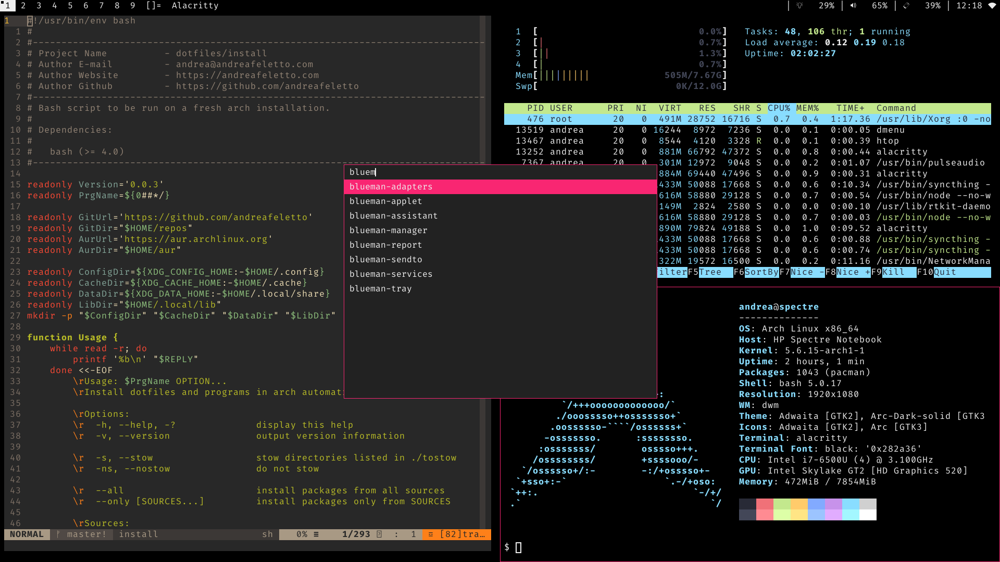

# My Dotfiles

## Screenshot


## How to
Every folder contains the dotfiles needed for the relative application.
First make sure that [GNU Stow](https://www.gnu.org/software/stow) is installed.
Clone this repository into the home directory:
```sh
cd ~
git clone https://github.com/andreafeletto/dotfiles.git
```
Move into the repository and run the install script:
```sh
cd dotfiles
./install
```
To install a subset of the configuration files just use Stow.
Just know that if a subdirectory of the chosen directory is not already
present it will be symlinked. This means that new files in the
subdirectory will also be added to the repository, which may not be
what you want.
```sh
mkdir -p ~/.config/nvim
stow neovim
```

## Install packages
Arch Linux:
```
grep -vh '^#' pkgs-arch pkgs-python | sudo pacman -Syu --needed -
```
Debian/Ubuntu (Not tested, packages may not exist):
```
grep -v '^#' pkgs-arch | xargs sudo apt install
```
Ruby Gems:
```
xargs -a pkgs-gem gem install
```
NodeJs NPM:
```
xargs -a pkgs-npm npm i -g
```
Termux:
```
xargs -a pkgs-termux pkg install
```

## Download wallpapers
Change the $dir and $urls (space separated string) variables then run:
```
./wall-download
```

## Partially stolen from...

[Luke Smith](https://github.com/LukeSmithxyz/voidrice)
